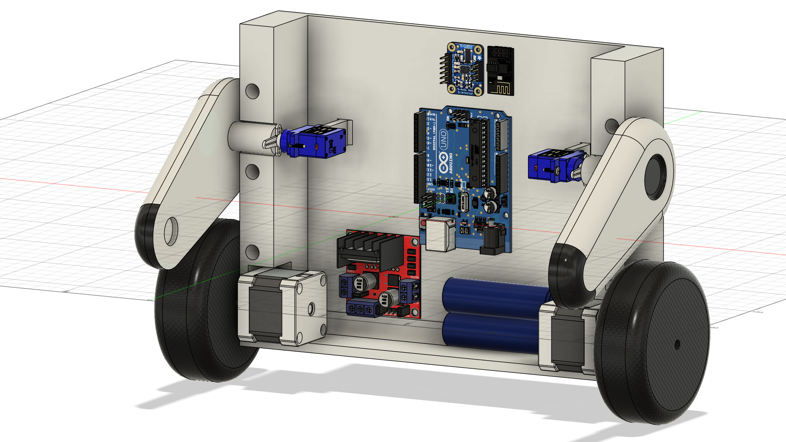

## Descripción del proyecto

Este proyecto recrea un robot inspirado en el modelo **M0-V** de la película *WALL·E*. Utiliza un controlador PID (pendiente de implementación) para alcanzar el equilibrio del sistema pendular invertido. Controlado mediante Arduino con dashboard en Processing para monitoreo y control en tiempo real.

## Características Principales
- Control de 2 servomotores (ángulo 0-180°)
- Manejo de 2 motores NEMA mediante puente H
- Lectura de orientación con MPU6050 (giroscopio/acelerómetro)
- Dashboard con:
  - Visualización de ángulos en 3 ejes
  - Gráficos de aceleración en tiempo real
  - Control manual de servos y motores
  - Consola serial integrada
- Sistema de calibración automática del giroscopio
- Soporte básico para control infrarrojo

  

## Hardware
| Componente               | Especificaciones                     |
|--------------------------|--------------------------------------|
| Microcontrolador         | Arduino Uno/nano/esp8266             |
| Sensor inercial          | MPU6050 (6 ejes)                     |
| Motores                  | NEMA 17 + Puente H L298N             |
| Servomotores             | Sg90 (180°)                          |
| Comunicación             | Serial USB + Receptor IR (RAW)       |
| Alimentación             | Batería LiPo 12V                     |

## Software

### Arduino

- Inicializa y calibra MPU6050  
- Comandos seriales:  
  - `S,a1,a2\n` → ajusta servos  
  - `M,vel,tiempo,motor\n` → controla motores  
- Lectura de IR y muestra código bruto  
- Envía telemetría periódica:
- Funciones de avance y freno

### Processing

- Conexión a puerto serie (115200 bps)
- Panel de telemetría: ángulos, aceleraciones, giroscopio
- Gráfico histórico de aceleraciones  
- Control para servos y motores  
- Consola serial integrada  
- Placeholder para futura visualización 3D

# ROADMAP

## Corto plazo

- Determinar y mapear **códigos IR** para control remoto
- Añadir LEDs controlabres por IR  
- Mejorar y depurar el código Arduino y Processing  
- Ajustar precisión de calibración y filtrado de sensores  
- En la dashboard:  
  - Cubo 3D que refleje en tiempo real **pitch/roll/yaw**  
  - Integrar sensor ultrasónico HC-SR04 y mostrar la línea de distancia al suelo dentro del cubo 3D  

## Mediano plazo

- Completar diseño del robot
- Impresión 3D de piezas estructurales  
- Simulación y análisis en ANSYS, determinacion de momentos de inercia y centro de masa para modelo fisico en PID
- Montaje completo de todos los componentes en el chasis impreso

## Largo plazo

- Implementar controlador **PID** completo en Arduino  
- Lograr equilibrio automático del robot en posición invertida  
- Control remoto por IR usando los códigos definidos  
- Diseñar e implementar PCB para sustituir protoboard  
- Añadir reconocimiento de obstáculos con ultrasonido y/o sensores adicionales  

